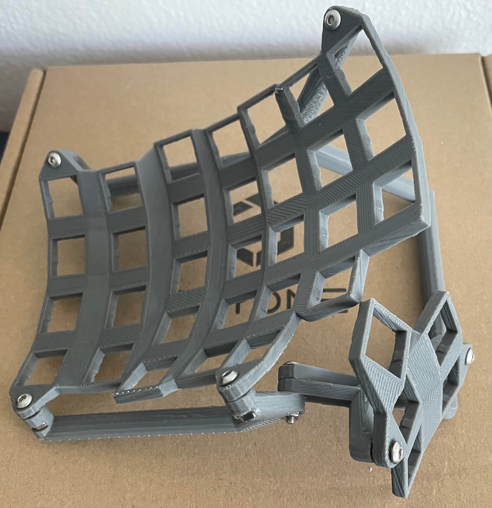

# The Dactyl-Pivot Keyboard

This is a fork of [Dactyl Manuform](https://github.com/abstracthat/dactyl-manuform) keyboard,
which in-turn is a fork of the [Dactyl Keyboard](https://github.com/adereth/dactyl-keyboard)

## Motivation: Closer Thumb Keys

For many people, Dactyl's thumb cluster sits too high. The Dactyl Manuform fixed this
issue by using a thumb cluster that is lower on the z axis, and also curves downwards.
Unfortunately, the Manuform thumb cluster ends up too far away from the home row, requiring
stretching of the thumb to reach the thumb keys.

In normal keyboards, the thumbs rest on the space bar. The tip of the thumb is actually
1.5 to 2 rows below the home row, between key B and the space bar. Comparing with the
original dactyl, the manuform variant's thumbs keys are much further away, mostly more
than 2 rows below the home row.

## Features

* A pivoting thumb cluster.
* Adjustable tenting.
* No more hollowing sound caused by the big case.
* Greater flexibility to key placement. We don't need to worry about
installation clearance.
* 3d printing of these cases takes less plastic, reducing waste.
* When customizing the design, each part can be experimented on
separately, leading to faster prototyping and less waste.  

## Two versions

In this repo, we try to bring the thumb keys back closer to the thumb resting position --
1.5 to 2 rows below home row, at the same time keep the thumb cluster low and curves
downwards, reducing stress on the thumb. During this process we created two versions:

dactyl-closed.clj 

This file describe a fulled enclosed case just like the Dactyl Manuform. We managed
to bring thumb keys much closer to the home row. Unfortunately, not quite close as
we want, due to clearance issue between the thumb cluster and the finger keys plate.
We have to leave enough installation clearance for installing and soldering key
switches below the plate. This forced us to leave gaps bewteen the thumb cluster and
the finger keys.

dactyl-open.clj

This file describe an open frame and multi-part design. This design not only allows
us to bring the thumb keys closer to the home row, it offers other benefits:

* A pivoting and adjustable thumb cluster.
* Adjustable tenting.
* No more hollowing sound caused by the big case.
* 3d printing of these cases takes less plastic, and less time.
* When customize the design, each part can be experimented on
seperatedly, leading to faster prototyping.  

### Generating a Design

**Setting up the Clojure environment**
* [Install the Clojure runtime](https://clojure.org)
* [Install the Leiningen project manager](http://leiningen.org/)
* [Install OpenSCAD](http://www.openscad.org/)

**Generating the design**
* cd into the root of the project
* Run `lein repl`
* Load the file `(load-file "src/dactyl_pivot/dactyl.clj")`
* This will generate or regenerate the `things/*.scad` files
* Use OpenSCAD to open a `.scad` file.
* Make changes to design, repeat `load-file`, OpenSCAD will watch for changes and rerender.
* When done, use OpenSCAD to export STL files

**Tips**
* [Some other ways to evaluate the clojure design file](http://stackoverflow.com/a/28213489)
* [Example designing with clojure](http://adereth.github.io/blog/2014/04/09/3d-printing-with-clojure/)

## License

Copyright © 2015 Matthew Adereth

The source code for generating the models (everything excluding the [things/](things/) and [resources/](resources/) directories is distributed under the [GNU AFFERO GENERAL PUBLIC LICENSE Version 3](LICENSE).  The generated models and PCB designs are distributed under the [Creative Commons Attribution-ShareAlike License Version 4.0](LICENSE-models).
